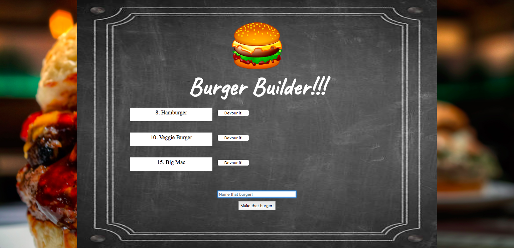
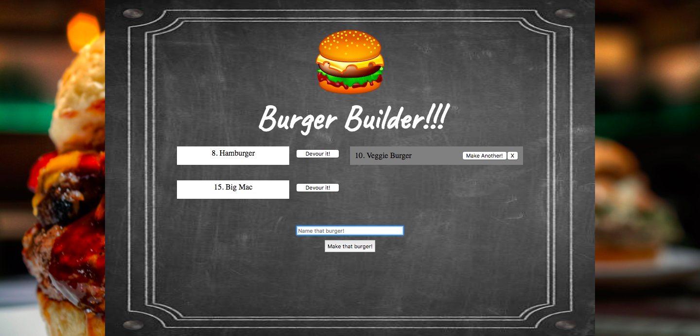
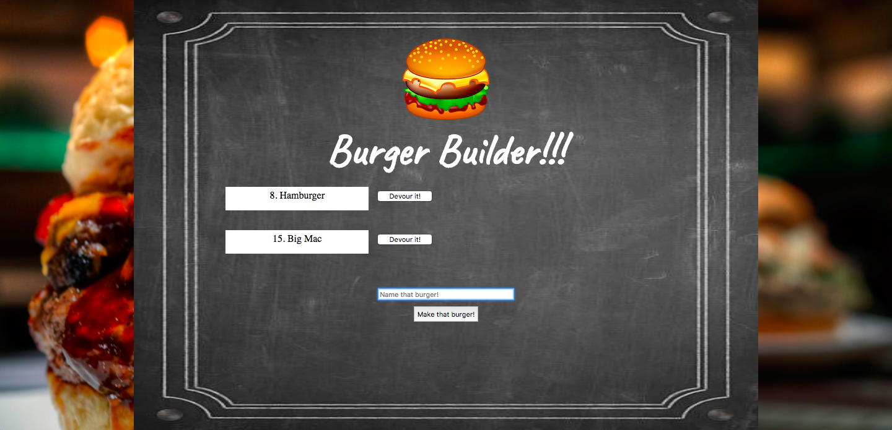

# Burger Builder

Burger Builder is an app where you can create, devour, make another of the same burger, and delete devoured burgers! Its objective is to show just a few of the types of queries you can use to update a MySQL database. Plus I splurged a little on the front-end style!

## Technologies used:
- MySQL
- ORM
- MVC
- HandleBarsJS
- ExpressJS

## Things you can do:

1. Create a Burger

2. Devour a Burger

3. Delete a Burger

4. Bonus! You can also just create a new burger that was previously devoured!